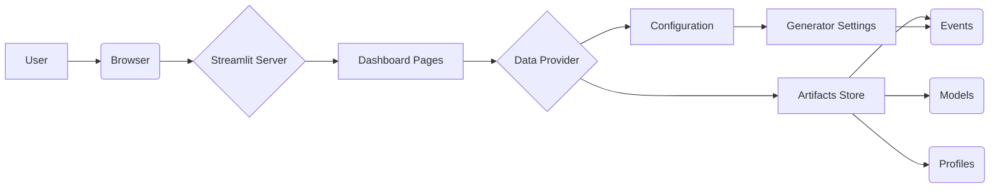

# Quick Start: Get Up and Running with AgeisAI

This guide will walk you through setting up your environment and running basic AgeisAI functionalities.

## 1. Project Setup

AgeisAI follows a standard Python project structure. The core logic resides in the `src/` directory, while configuration and dashboard components are in their respective top-level folders.

### Repository Structure

```mermaid
graph TD
    A[AgeisAI Repository Root] --> B(src/);
    A --> C(dashboard/);
    A --> D(config/);
    A --> E(docs/);
    A --> F(tests/);
    A --> G(README.md);
    A --> H(project.md);
    A --> I(app.py);
    A --> J(requirements.txt);

    B --> B1(generator/);
    B --> B2(features/);
    B --> B3(models/);
    B --> B4(detection/);
    B --> B5(profiling/);
    B --> B6(explainability/);
    B --> B7(adaptation/);

    C --> C1(components.py);
    C --> C2(theme.py);
    C --> C3(overview.py);
    C --> C4(alerts.py);
    C --> C5(entity_view.py);
    C --> C6(simulator.py);
    C --> C7(performance.py);
    C --> C8(replay_service.py);

    D --> D1(config.yaml);

    E --> E1(ARCHITECTURE.md);
    E --> E2(DECISIONS.md);

    F --> F1(test_smoke.py);
    F --> F2(test_simulator.py);
```



### Installation

Ensure you have Python 3.11+ installed.

1.  **Create a virtual environment:**
    ```bash
    python -m venv .venv
    ```

2.  **Activate the environment:**
    *   **Windows PowerShell:**
        ```powershell
        .venv\Scripts\activate
        ```
    *   **macOS / Linux:**
        ```bash
        source .venv/bin/activate
        ```

3.  **Install dependencies:**
    ```bash
    pip install -r requirements.txt
    ```

> [!TIP]
> **Suggestion:** Consider using `pip-tools` for more robust dependency management, especially for larger projects. This allows for better pinning of versions and easier generation of `requirements.txt` from a `requirements.in` file.

## 2. Running the Application

AgeisAI provides a Streamlit-based dashboard for visualizing its capabilities.

### Launching the Dashboard

Navigate to the repository root in your terminal and run:

```bash
streamlit run app.py
```

This will launch the AgeisAI SOC console, typically accessible at `http://localhost:8501`.

### Dashboard Overview

The dashboard provides a comprehensive view of the system's status and capabilities. It's designed to be informative even before all data artifacts are generated.

*   **Navigation:** Use the sidebar to switch between different pages (Overview, Alerts, Entity View, Simulator, Performance).
*   **Status Indicators:** The sidebar displays the status of prerequisite artifacts, indicating which phase produces them and the command to generate them.



The dashboard's theme is managed by `dashboard/theme.py`, ensuring a consistent visual language across all components.

```python
# source: dashboard/theme.py:L10-L20
def apply() -> None:
    """Inject the stylesheet and register the Plotly template. Idempotent."""
    _register_plotly_template()
    st.markdown(_CSS, unsafe_allow_html=True)

# ... (rest of the theme.py file)
```

## 3. Core Functionality: Event Processing

The heart of AgeisAI is its ability to process events, generate features, and detect anomalies.

### The `process_event` Function

This function orchestrates the entire detection pipeline for a single event.

```python
# source: src/detection/detector.py:L10-L25
def process_event(
    event: pd.Series,
    ctx: DetectionContext,
) -> DetectionResult:
    """Process a single event through the detection pipeline."""
    # 1. Load entity profile
    profile = ctx.profile_store.get(event.entity_id)
    if profile is None:
        # Handle cold start or missing profile
        profile = ctx.profile_store.get_cohort(event.entity_type) # Example

    # 2. Calculate features
    features = ctx.feature_engine.transform(event, profile)

    # 3. Run anomaly model
    anomaly_score = ctx.anomaly_model.predict(features)

    # 4. Run sequence scoring (if applicable)
    sequence_score = ctx.sequence_model.score(event, profile)

    # 5. Run classifier
    attack_prediction = ctx.attack_classifier.predict(features)

    # 6. Calculate risk and generate explanations
    risk_score, explanations = ctx.risk_engine.calculate(
        event, features, anomaly_score, sequence_score, attack_prediction
    )

    # 7. Create alert object and determine threshold
    alerted = risk_score >= ctx.alert_threshold
    alert = Alert(
        event_id=event.event_id,
        entity_id=event.entity_id,
        timestamp=event.timestamp,
        risk_score=risk_score,
        severity=ctx.severity_mapper.map(risk_score),
        explanations=explanations,
        alerted=alerted,
    )

    # 8. Add safe profile-update decision
    if ctx.profile_updater.should_update(event, profile, alerted):
        ctx.profile_store.update(event.entity_id, profile)

    return DetectionResult(alert=alert, alerted=alerted, latency_ms=ctx.latency_ms)

```

> [!IMPORTANT]
> **Critical Improvement:** The `process_event` function should explicitly handle the case where `profile` is `None` after attempting to retrieve both personal and cohort profiles. Currently, it proceeds with a potentially `None` profile, which will likely cause downstream errors. A clear strategy for handling completely unknown entities (e.g., logging an error, assigning a default "unknown" profile) is needed.

## 4. Next Steps

*   **Explore the Dashboard:** Familiarize yourself with the different pages and visualizations.
*   **Run the Simulator:** Use the "Attack Simulator" page to inject synthetic attacks and observe detection.
*   **Examine Configuration:** Review `config/config.yaml` to understand tunable parameters.
*   **Dive Deeper:** Refer to `project.md` for a detailed breakdown of development phases and `docs/ARCHITECTURE.md` for architectural decisions.


