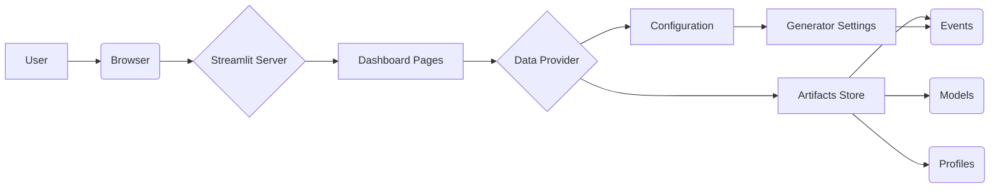
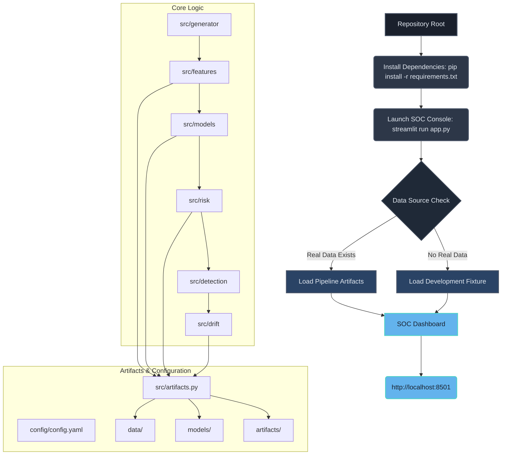
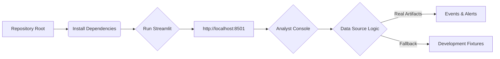
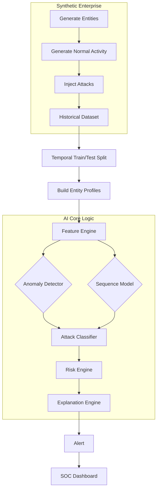
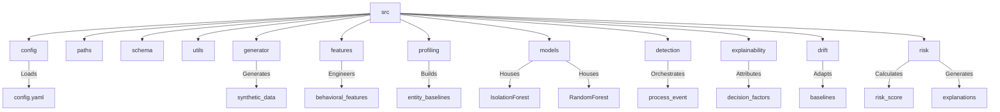
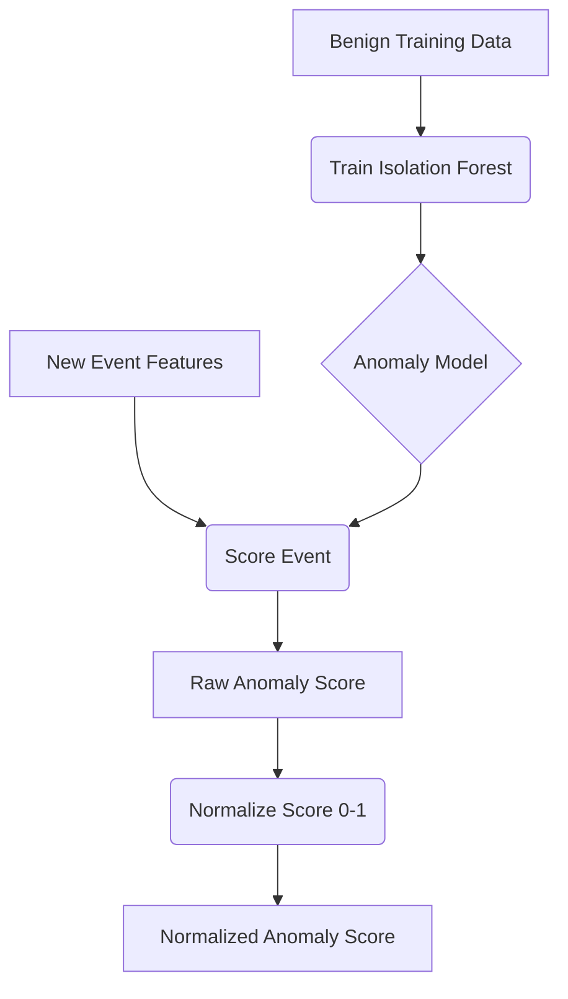
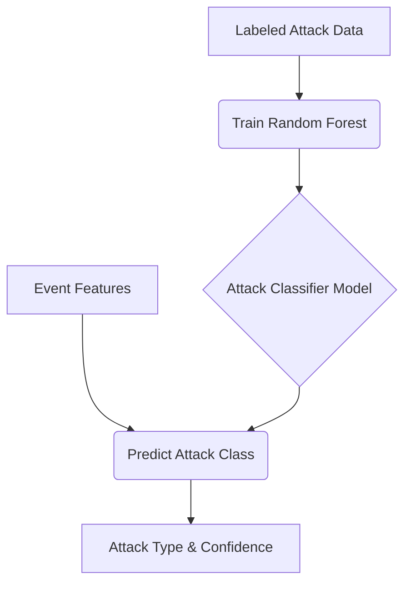
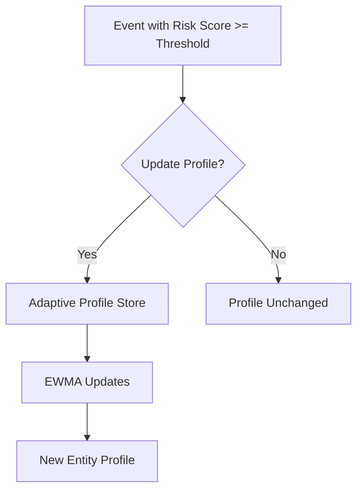

# Quick Start: Get Up and Running with AgeisAI

This guide will walk you through setting up your environment and running basic AgeisAI functionalities.

## 1. Project Setup

AgeisAI follows a standard Python project structure. The core logic resides in the `src/` directory, while configuration and dashboard components are in their respective top-level folders.

### Repository Structure

```mermaid
graph TD
    A[AgeisAI Repository Root] --> B(src/);
    A --> C(dashboard/);
    A --> D(config/);
    A --> E(docs/);
    A --> F(tests/);
    A --> G(README.md);
    A --> H(project.md);
    A --> I(app.py);
    A --> J(requirements.txt);

    B --> B1(generator/);
    B --> B2(features/);
    B --> B3(models/);
    B --> B4(detection/);
    B --> B5(profiling/);
    B --> B6(explainability/);
    B --> B7(adaptation/);

    C --> C1(components.py);
    C --> C2(theme.py);
    C --> C3(overview.py);
    C --> C4(alerts.py);
    C --> C5(entity_view.py);
    C --> C6(simulator.py);
    C --> C7(performance.py);
    C --> C8(replay_service.py);

    D --> D1(config.yaml);

    E --> E1(ARCHITECTURE.md);
    E --> E2(DECISIONS.md);

    F --> F1(test_smoke.py);
    F --> F2(test_simulator.py);
```



### Installation

Ensure you have Python 3.11+ installed.

1.  **Create a virtual environment:**
    ```bash
    python -m venv .venv
    ```

2.  **Activate the environment:**
    *   **Windows PowerShell:**
        ```powershell
        .venv\Scripts\activate
        ```
    *   **macOS / Linux:**
        ```bash
        source .venv/bin/activate
        ```

3.  **Install dependencies:**
    ```bash
    pip install -r requirements.txt
    ```

> [!TIP]
> **Suggestion:** Consider using `pip-tools` for more robust dependency management, especially for larger projects. This allows for better pinning of versions and easier generation of `requirements.txt` from a `requirements.in` file.

## 2. Running the Application

AgeisAI provides a Streamlit-based dashboard for visualizing its capabilities.

### Launching the Dashboard

Navigate to the repository root in your terminal and run:

```bash
streamlit run app.py
```

This will launch the AgeisAI SOC console, typically accessible at `http://localhost:8501`.

### Dashboard Overview

The dashboard provides a comprehensive view of the system's status and capabilities. It's designed to be informative even before all data artifacts are generated.

*   **Navigation:** Use the sidebar to switch between different pages (Overview, Alerts, Entity View, Simulator, Performance).
*   **Status Indicators:** The sidebar displays the status of prerequisite artifacts, indicating which phase produces them and the command to generate them.



The dashboard's theme is managed by `dashboard/theme.py`, ensuring a consistent visual language across all components.

```python
# source: dashboard/theme.py:L10-L20
def apply() -> None:
    """Inject the stylesheet and register the Plotly template. Idempotent."""
    _register_plotly_template()
    st.markdown(_CSS, unsafe_allow_html=True)

# ... (rest of the theme.py file)
```

## 3. Core Functionality: Event Processing

The heart of AgeisAI is its ability to process events, generate features, and detect anomalies.

### The `process_event` Function

This function orchestrates the entire detection pipeline for a single event.

```python
# source: src/detection/detector.py:L10-L25
def process_event(
    event: pd.Series,
    ctx: DetectionContext,
) -> DetectionResult:
    """Process a single event through the detection pipeline."""
    # 1. Load entity profile
    profile = ctx.profile_store.get(event.entity_id)
    if profile is None:
        # Handle cold start or missing profile
        profile = ctx.profile_store.get_cohort(event.entity_type) # Example

    # 2. Calculate features
    features = ctx.feature_engine.transform(event, profile)

    # 3. Run anomaly model
    anomaly_score = ctx.anomaly_model.predict(features)

    # 4. Run sequence scoring (if applicable)
    sequence_score = ctx.sequence_model.score(event, profile)

    # 5. Run classifier
    attack_prediction = ctx.attack_classifier.predict(features)

    # 6. Calculate risk and generate explanations
    risk_score, explanations = ctx.risk_engine.calculate(
        event, features, anomaly_score, sequence_score, attack_prediction
    )

    # 7. Create alert object and determine threshold
    alerted = risk_score >= ctx.alert_threshold
    alert = Alert(
        event_id=event.event_id,
        entity_id=event.entity_id,
        timestamp=event.timestamp,
        risk_score=risk_score,
        severity=ctx.severity_mapper.map(risk_score),
        explanations=explanations,
        alerted=alerted,
    )

    # 8. Add safe profile-update decision
    if ctx.profile_updater.should_update(event, profile, alerted):
        ctx.profile_store.update(event.entity_id, profile)

    return DetectionResult(alert=alert, alerted=alerted, latency_ms=ctx.latency_ms)

```

> [!IMPORTANT]
> **Critical Improvement:** The `process_event` function should explicitly handle the case where `profile` is `None` after attempting to retrieve both personal and cohort profiles. Currently, it proceeds with a potentially `None` profile, which will likely cause downstream errors. A clear strategy for handling completely unknown entities (e.g., logging an error, assigning a default "unknown" profile) is needed.

## 4. Next Steps

*   **Explore the Dashboard:** Familiarize yourself with the different pages and visualizations.
*   **Run the Simulator:** Use the "Attack Simulator" page to inject synthetic attacks and observe detection.
*   **Examine Configuration:** Review `config/config.yaml` to understand tunable parameters.
*   **Dive Deeper:** Refer to `project.md` for a detailed breakdown of development phases and `docs/ARCHITECTURE.md` for architectural decisions.


# AgeisAI Installation Guide

This guide outlines the straightforward installation and execution process for the AgeisAI project. Due to its "run-in-place" design, there's no traditional installation step. You'll primarily focus on setting up your environment and then running the application directly from the repository root.

## 1. Project Setup

AgeisAI is designed to be run directly from the repository without a formal installation process. This is achieved by ensuring the repository root is added to the Python path.

### Environment Setup

First, create and activate a Python virtual environment.

```bash
# Create a virtual environment
python -m venv .venv

# Activate the virtual environment
# Windows PowerShell:
.venv\Scripts\activate
# macOS / Linux:
# source .venv/bin/activate
```

### Install Dependencies

Install all necessary Python packages using the provided `requirements.txt` file.

```bash
# source: README.md:L15
pip install -r requirements.txt
```

> [!TIP]
> **Suggestion:** Regularly update `requirements.txt` to reflect the latest dependencies and ensure reproducibility. Consider using tools like `pip-freeze` or dependency management solutions for more robust management.

## 2. Running the Application

Once dependencies are installed, you can launch the AgeisAI SOC console.

### Launching the SOC Console

The console is launched using `streamlit` from the repository's root directory.

```bash
# source: README.md:L20
streamlit run app.py
```

This command will start the Streamlit server, and you can access the SOC console by navigating to `http://localhost:8501` in your web browser.

### Data Handling

The console intelligently handles data sources:
*   **Default Behavior:** If `events` and `alerts` artifacts exist, it prefers real pipeline data.
*   **Fallback:** If real data is not available, it gracefully falls back to a clearly labeled development fixture.

## 3. Project Structure and Execution Flow

AgeisAI utilizes a `src/` layout and a root `conftest.py` to manage imports and execution from the repository root.

### Run-in-Place Layout

The project is structured to be run directly from the root directory. A `conftest.py` file at the root ensures that the `src/` directory is importable by adding it to `sys.path`.

```python
# source: conftest.py:L10-L15
"""Makes the repository root importable so tests can ``import src.*``.

Kept at the root (rather than shipping a packaging config) because the project
is run in place: ``pytest``, ``python -m src...`` and ``streamlit run app.py``
all execute from the repository root.
"""

from __future__ import annotations

import sys
from pathlib import Path

ROOT = Path(__file__).resolve().parent
if str(ROOT) not in sys.path:
    sys.path.insert(0, str(ROOT))
```

This approach simplifies setup, as no explicit installation or packaging is required.

### Execution Diagram

The following diagram illustrates the general flow of execution and module dependencies within AgeisAI, highlighting how different components interact.



## 4. Key Components and Artifacts

AgeisAI's functionality is organized into distinct phases, each producing specific artifacts. The `src/artifacts.py` module serves as a central registry for all pipeline outputs.

### Artifact Registry

The `src/artifacts.py` file defines all outputs generated by the pipeline, including their location, the phase that produces them, and the command used for their creation. This ensures consistency and traceability.

```python
# source: src/artifacts.py:L10-L20
    Artifact(
        key="feature_validation",
        directory="artifacts",
        filename="feature_validation.json",
        phase=4,
        produced_by="python -m src.features",
        description="Feature sanity and leakage validation summary",
    ),
    Artifact(
        key="anomaly_detector",
        directory="models",
        filename="anomaly_detector.joblib",
        phase=6,
        produced_by="python -m src.models.anomaly_detector",
        description="IsolationForest detector bundle (preprocessing + model + feature order + config)",
    ),
    Artifact(
        key="anomaly_thresholds",
        directory="models",
        filename="anomaly_thresholds.json",
        phase=6,
        produced_by="python -m src.models.anomaly_detector",
        description="Calibrated operating-point thresholds and methodology",
    )
```

> [!TIP]
> **Suggestion:** The artifact registry is crucial for understanding pipeline dependencies. Consider adding a diagram visualizing these dependencies to the documentation for easier comprehension.

### Module Map

The project's modules are organized within the `src/` directory, each responsible for a specific aspect of the AI pipeline.

```mermaid
graph TD
    A[src/config.py] --> B(YAML Configuration)
    C[src/paths.py] --> D(Project Paths)
    E[src/schema.py] --> F(Event Contract)
    G[src/artifacts.py] --> H(Artifact Registry)
    I[src/utils/] --> J(Utilities: seeding, geo, logging)
    K[src/evaluation/] --> L(Metrics & Reporting)
    M[src/generator/] --> N(Data Generation)
    O[src/features/] --> P(Feature Engineering)
    Q[src/profiling/] --> R(Baselines & Cold Start)
    S[src/models/] --> T(Anomaly & Attack Models)
    U[src/risk/] --> V(Risk Engine & Explanations)
    W[src/drift/] --> X(Adaptive Profiles & Drift)
    Y[src/detection/] --> Z(Streaming Processing)
    AA[dashboard/] --> BB(SOC Console)

    classDef module fill:#2D3748,stroke:#4A5568,stroke-width:2px,color:#E2E8F0
    class A,C,E,G,I,K,M,O,Q,S,U,W,Y,AA module
```



This setup allows for a clear separation of concerns and facilitates code exploration by providing a structured overview of the project's components.


## Running the Application

The AEGIS analyst console provides a real-time interface for monitoring and investigating security events. It's built using Streamlit, allowing for rapid development and deployment of interactive dashboards.

### Launching the Console

To run the application, navigate to the repository root in your terminal after installing dependencies.

```bash
# source .venv/bin/activate  # macOS / Linux
.venv\Scripts\activate      # Windows PowerShell
pip install -r requirements.txt
streamlit run app.py
```

This command will launch the Streamlit application, and you can access the console by opening your web browser to `http://localhost:8501`.

### Data Sources

The console intelligently selects its data source:

*   **Default Behavior:** When `dashboard.data_source: auto` is set (the default), the console prioritizes real pipeline artifacts if both `events` and `alerts` data exist.
*   **Development Fallback:** If real pipeline artifacts are not available, the console gracefully falls back to using clearly labeled development fixtures. This ensures the dashboard is always functional, even during early development stages.

### Console Overview

The console is designed to provide a comprehensive view of security events and potential threats.



The console is structured into several pages, each serving a specific purpose:

| Page                | Purpose                                                                                             |
| :------------------ | :-------------------------------------------------------------------------------------------------- |
| SOC Overview        | Risk summary, severity/attack mix, top entities, recent high-priority alerts                        |
| Alert Queue         | Ranked triage list with filters + explainable alert detail                                          |
| Entity Investigation| Baseline profile, risk evolution, alert reasons, event history                                      |
| Streaming Replay    | Reliable batch demo of Phase 9 `process_event()` (optional)                                         |
| Attack Simulator    | Inject a real generator campaign through `process_event`; alerts join the SOC session overlay       |
| Model Performance   | Evaluation/debug metrics from Phase 12 artifacts only                                               |

### Verifying Live Demonstration

Before presenting, it's crucial to verify the live demonstration end-to-end. This process runs all seven attack scenarios through the real detection pipeline and reports risk, severity, and latency for each.

```bash
python scripts/verify_live_demo.py
```

This script ensures that the entire detection pipeline, from event generation to alert surfacing, functions as expected.

> [!IMPORTANT]
> **Critical Improvement:** The `verify_live_demo.py` script should ideally integrate with the testing framework (`pytest`) to provide automated verification of the live demo's core functionality. This would ensure consistency and prevent regressions.


# Core AI Logic (`src/`)

The `src/` directory houses the core AI functionalities of AgeisAI. This is where the system's intelligence resides, encompassing data generation, feature engineering, anomaly detection, attack classification, risk assessment, and explainability.

## 1. Project Overview & Data Flow

AgeisAI aims to detect behavioral anomalies in IT/OT systems by modeling normal activity and identifying deviations. The core product flow involves generating synthetic data, injecting attacks, building entity profiles, engineering features, and then passing these through a series of AI models to produce alerts with explainable risk scores.



### Key AI Components:

*   **Anomaly Detector:** Identifies deviations from normal behavior.
*   **Sequence Model:** Analyzes temporal patterns in behavior.
*   **Attack Classifier:** Determines the type of attack an anomaly resembles.
*   **Risk Engine:** Assigns a risk score and manages alert state.
*   **Explanation Engine:** Provides reasons for the detected anomalies and risk scores.

## 2. Module Breakdown

The `src/` directory is organized into sub-packages, each corresponding to a specific phase or functionality of the AI pipeline.



### Core Sub-packages:

*   **`src/config`**: Manages configuration loading.
*   **`src/features`**: Handles feature engineering.
*   **`src/profiling`**: Builds per-entity behavioral baselines.
*   **`src/models`**: Contains the anomaly detection (IsolationForest) and attack classification (RandomForest) models.
*   **`src/detection`**: Orchestrates the real-time event processing pipeline.
*   **`src/risk`**: Implements the hybrid risk engine and explanation generation.
*   **`src/drift`**: Manages adaptive baseline updates to handle concept drift.

## 3. Anomaly Detection (Phase 5)

The anomaly detection module employs an Isolation Forest to identify unusual events. It's trained exclusively on benign data, ensuring it learns the patterns of normal behavior.



### Key Concepts:

*   **Isolation Forest:** An unsupervised learning algorithm effective for anomaly detection.
*   **Benign Training Data:** The model learns what is *normal* by being trained only on data labeled as benign.
*   **Raw Anomaly Score:** The initial output from the Isolation Forest.
*   **Normalized Score:** The raw score is scaled to a 0-1 range for easier interpretation and use in downstream components.

> [!TIP]
> **Suggestion:** The `src/models/anomaly_detector.py` script can be extended to include more detailed performance metrics beyond PR-AUC and ROC-AUC, such as precision, recall, and F1 scores at various operating points, as outlined in `docs/REPORT.md` and `project.md`.

## 4. Attack Classification (Phase 7)

Once an anomaly is detected, the `src/models/classifier` module uses a supervised Random Forest to predict the type of attack it resembles. This model is trained on labeled attack data.



### Key Concepts:

*   **Random Forest:** A robust ensemble learning method for classification.
*   **Labeled Attack Data:** Crucial for training the classifier to distinguish between different attack types.
*   **Class Imbalance:** The classifier must be robust to the rarity of specific attack types.

```python
# source: src/models/classifier.py:L15-L25
from sklearn.ensemble import RandomForestClassifier
from sklearn.preprocessing import StandardScaler

from src.artifacts import artifact_path
from src.config import load_config
from src.features import MODEL_FEATURE_COLUMNS
from src.schema import ATTACK_CLASSES, AttackType, assert_no_label_leakage
from src.utils.seeding import derive_seed

#: Classes the classifier is trained to separate, including BENIGN.
CLASSIFIER_CLASSES: tuple[str, ...] = (AttackType.BENIGN.value, *ATTACK_CLASSES)
```

## 5. Risk Engine and Explainability (Phase 8)

The `src/risk` package combines anomaly scores, attack classifications, and contextual features to produce a final, explainable risk score. It also generates reasons for the score.

```mermaid
erDiagram
    Event {
        string event_id PK
        timestamp timestamp
        string entity_id FK
        string entity_type
        float anomaly_score_raw
        string baseline_rule
        string attack_type
        float confidence
    }
    EntityRiskState {
        string entity_id PK
        float current_risk_score
        timestamp last_updated
        float persistence_state
    }
    RiskEngine --> Event : Consumes
    RiskEngine --> EntityRiskState : Manages
    RiskEngine --> Explanation : Generates
```

### Hybrid Risk Calculation:

The risk engine uses a weighted combination of:

1.  **Anomaly Score:** From the Isolation Forest.
2.  **Rule Baseline:** A simpler, rule-based anomaly detector.
3.  **Behavioral Features:** Engineered features capturing context.
4.  **Time Decay:** Exponential decay of past risk to account for persistence.

This hybrid approach aims for robustness and explainability.

```python
# source: src/risk/engine.py:L50-L70
    if_act = isolation_forest_activation(if_score, self.calibration)
    rule_act = rule_activation(rule_score, self.calibration)
    context_acts: dict[str, float] = {}
    for signal in self.spec.context:
        context_acts[signal.name] = context_activation(
            signal, feature_row, self.calibration
        )

    if_evidence = self.spec.isolation_forest_weight * if_act
    rule_evidence = self.spec.rule_weight * rule_act
    context_evidence = sum(
        self.spec.context_weights[name] * act
        for name, act in context_acts.items()
    )

    # ... (rest of risk calculation)
```

### Explainability:

The `src/explainability` module provides deterministic attribution for the risk score, detailing which factors contributed most significantly.

> [!IMPORTANT]
> **Critical Improvement:** The risk weights are currently prototype calibration parameters. For production, consider exploring methods to learn or dynamically adjust these weights based on feedback or observed performance to optimize risk scoring accuracy.

## 6. Concept Drift Handling (Phase 9)

The `src/drift` module addresses concept drift by adaptively updating entity profiles. This ensures the system remains accurate as legitimate user behavior evolves over time.



### Adaptive Updates:

*   **Risk Gating:** Updates are only applied to events with risk scores below a certain threshold to prevent poisoning by malicious activity.
*   **EWMA (Exponentially Weighted Moving Average):** Used for updating continuous and categorical statistics in profiles.

> [!WARNING]
> **Potential Issue:** The current implementation relies on a fixed `halflife_seconds` and `persistence_weight` in `src/drift/store.py`. These parameters might need dynamic adjustment or a more sophisticated decay mechanism to effectively handle varying rates of concept drift.

## 7. Integration and Inference (`src/detection`)

The `src/detection/engine.py` module orchestrates the end-to-end processing of events. It loads models, computes features, runs detectors, and generates alerts.

```mermaid
flowchart TD
    A[Incoming Event] --> B(Validate Event)
    B --> C(Resolve Entity Profile)
    C --> D(Compute Event Features)
    D --> E(Run Anomaly Detector)
    D --> F(Run Sequence Model)
    E --> G(Run Attack Classifier)
    F --> G
    G --> H(Calculate Risk Score)
    H --> I(Generate Explanations)
    I --> J(Create Alert Object)
    J --> K{Alert Threshold Exceeded?}
    K -- Yes --> L[Emit Alert]
    K -- No --> M[Update Profile (if safe)]
```

### `process_event()` Function:

This central function ties together all the AI components for live inference.

```python
# source: src/detection/engine.py:L100-L120
        profile, profile_source, profile_confidence = self._resolve_profile(cleaned)
        feature_dict = compute_event_features(
            cleaned,
            history=history,
            previous_fingerprint=self.previous_fingerprint.get(entity_id),
            profile=profile,
            profile_source=profile_source,
            profile_confidence=profile_confidence,
            smoothing=self.smoothing,
            std_floor=self.std_floor,
            velocity_cap=self.velocity_cap,
            # Live inference has no train/eval split; omit evaluation metadata.
            cutoff=None,
        )
        assert_no_label_leakage(feature_dict.keys())
        feature_frame = pd.DataFrame([feature_dict])
        # Attach detectors.
        anomaly_raw = float(self.anomaly_model.raw_scores(feature_frame)[0])
```

> [!TIP]
> **Suggestion:** The `history_retention_hours` parameter in `src/detection/engine.py` could be made dynamic or configurable based on entity type or risk profile to optimize memory usage and performance for different entities.
