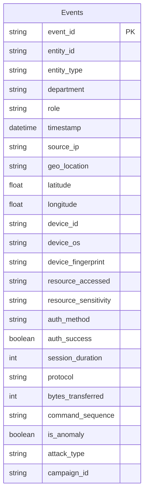
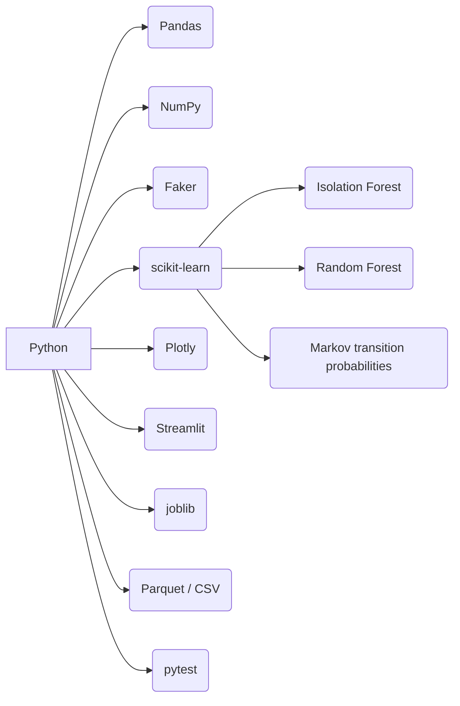
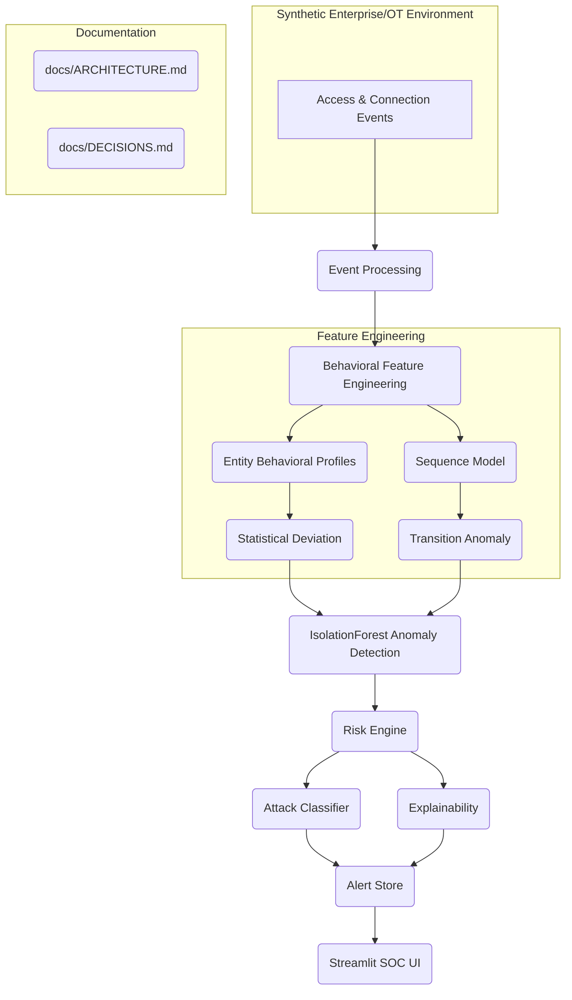
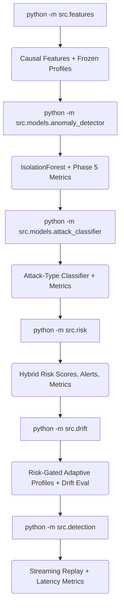

# AgeisAI Repository README

This document provides a concise overview of the AgeisAI repository, focusing on its setup, architecture, and core functionalities.

## 1. Project Overview

AgeisAI is a system designed for detecting anomalies and malicious activities within enterprise and OT environments. It processes access and connection events to engineer behavioral features, detect anomalies using Isolation Forest, and classify potential attacks. The system includes a Streamlit-based SOC console for visualization and analysis.

## 2. Setup and Installation

To set up and run AgeisAI, ensure you have Python 3.11+ installed.

### Environment Setup

```bash
# Create a virtual environment
python -m venv .venv

# Activate the virtual environment
# Windows PowerShell:
.venv\Scripts\activate
# macOS / Linux:
# source .venv/bin/activate

# Install dependencies
pip install -r requirements.txt

# Run tests (optional, but recommended)
pytest -q
```

### Running the SOC Console

The Streamlit console provides a user interface for monitoring and analysis.

```bash
streamlit run app.py
```

The console will launch at `http://localhost:8501`. It's designed to show the readiness of data artifacts and the commands needed to generate them, even before any data exists.

> [!TIP]
> All tunable parameters are managed in `config/config.yaml`. For reproducible runs, `seed.master` is used. The `generator.profile` setting allows switching between a small `dev` dataset and the `full` one.

## 3. Repository Structure

The repository is organized to facilitate modular development and clear separation of concerns.

```mermaid
flowchart TD
    A[aegis/] --> B(app.py);
    A --> C(README.md);
    A --> D(PROJECT_PLAN.md);
    A --> E(requirements.txt);
    A --> F(config/);
    A --> G(data/);
    A --> H(models/);
    A --> I(src/);
    A --> J(tests/);
    A --> K(docs/);

    F --> F1(config.yaml);

    G --> G1(raw/);
    G --> G2(processed/);
    G --> G3(generated/);

    I --> I1(generator/);
    I --> I2(profiling/);
    I --> I3(features/);
    I --> I4(models/);
    I --> I5(detection/);
    I --> I6(explainability/);
    I --> I7(adaptation/);
    I --> I8(schema.py);
    I --> I9(artifacts.py);
    I --> I10(evaluation/);

    I1 --> I1a(entities.py);
    I1 --> I1b(normal_behavior.py);
    I1 --> I1c(attacks.py);
    I1 --> I1d(generator.py);

    I2 --> I2a(entity_profile.py);
    I2 --> I2b(cohort_profile.py);

    I3 --> I3a(behavioral.py);
    I3 --> I3b(geographic.py);
    I3 --> I3c(temporal.py);
    I3 --> I3d(sequence.py);

    I4 --> I4a(anomaly_detector.py);
    I4 --> I4b(attack_classifier.py);
    I4 --> I4c(sequence_model.py);

    I5 --> I5a(detector.py);
    I5 --> I5b(risk_engine.py);
    I5 --> I5c(engine.py);

    I6 --> I6a(explainer.py);

    I7 --> I7a(cold_start.py);
    I7 --> I7b(drift.py);

    J --> J1(conftest.py);
    J --> J2(test_smoke.py);
    J --> J3(test_attacks.py);
    J --> J4(test_drift.py);
    J --> J5(test_dashboard_shell.py);

    K --> K1(DECISIONS.md);
    K --> K2(ARCHITECTURE.md);
```



### Key Directories and Files:

*   **`app.py`**: Streamlit entry point for the SOC console.
*   **`config/config.yaml`**: The single source of truth for all tunable parameters.
*   **`src/`**: Contains the core library code for the AgeisAI system.
    *   **`schema.py`**: Defines the canonical event contract, threat taxonomy, and leakage guards.
    *   **`artifacts.py`**: Registers all pipeline outputs, their producing phases, and creation commands.
    *   **`generator/`**: Code for generating synthetic datasets.
    *   **`profiling/`**: Modules for creating entity and cohort behavioral profiles.
    *   **`features/`**: Feature engineering components (behavioral, geographic, temporal, sequence).
    *   **`models/`**: Machine learning models for anomaly detection and attack classification.
    *   **`detection/`**: Modules for real-time anomaly detection and risk scoring.
    *   **`evaluation/`**: Imbalance-aware metrics and reporting tools.
*   **`dashboard/`**: Components for the Streamlit SOC console.
*   **`tests/`**: Pytest suite for various aspects of the system.
*   **`docs/`**: Project documentation, including Architecture Decision Records (ADRs) and architecture diagrams.
*   **`data/`**: Stores generated datasets (git-ignored).
*   **`models/`**: Persisted models and entity profiles (git-ignored).
*   **`artifacts/`**: Stores alerts, evaluation figures, and metric exports (git-ignored).

## 4. Data Schema

The system processes access events with a defined schema. Ground-truth fields (`is_anomaly`, `attack_type`) are critical and must never be used as model input features.



> [!WARNING]
> **Critical Rule:** Ground-truth fields (`is_anomaly`, `attack_type`) must **never** be accidentally included in the feature space. They are strictly for training and evaluation.

## 5. Technology Stack

The project prioritizes a simple and manageable technology stack.



**Avoid:** TensorFlow, PyTorch, Transformers, Kafka, Redis, React, FastAPI, Docker, LLM APIs, Databases, Cloud services (initially).

## 6. Architecture Overview

The AgeisAI architecture processes events through several phases, culminating in anomaly detection, risk assessment, and visualization.



### Key Architectural Decisions:

*   **Single Artifact Registry (`src/artifacts.py`)**: Ensures consistency between producers and consumers of pipeline outputs.
*   **Config-as-Single-Source-of-Truth (`config/config.yaml`)**: All tunable parameters are managed centrally.
*   **Headless Console Verification (`tests/test_dashboard_shell.py`)**: Ensures the UI remains functional even with no data.

## 7. Offline Detection Pipeline

The offline pipeline processes data in distinct stages, each executable via a command-line interface.



For long-lived event streams, you can either use the stateful module interface or manage the engine explicitly.

```python
# source: src/detection/engine.py:L50-L65
from src.detection import StreamingEngine, process_event

# Process events with a local, reused engine
result = process_event(event)

# Explicit lifecycle control for services/tests
engine = StreamingEngine.load(apply_drift_updates=True)
result = process_event(event, engine=engine)
```

The `result` object contains anomaly/risk scores, severity, classifier hypotheses, explanations, alert outcomes, profile source, and adaptive update decisions.

## 8. Dataset Generation

Synthetic datasets can be generated for development and testing.

```bash
# Generate dev profile with attacks injected
python -m src.generator

# Generate full profile with attacks injected
python -m src.generator --profile full

# Generate only benign data (no campaigns)
python -m src.generator --benign-only
```

This process creates `data/generated/entities.json` (ground-truth entity definitions) and `data/generated/events.parquet` (labelled event dataset).

> [!TIP]
> The generator reports the *achieved* attack prevalence and campaign counts, which may differ from configured targets due to clamping campaign sizes to plausible shapes.

## 9. Attack Taxonomy

The system is designed to detect various attack types.

### Attack Types:

*   **Brute Force**: Multiple authentication attempts from one source in a short period.
*   **Impossible Travel**: Physically implausible geographic velocity between events.
*   **Credential Stuffing**: Small number of attacker IPs targeting many entity IDs with failed authentications.
*   **Lateral Movement**: Compromised entity accessing unusual resources sequentially.
*   **Device Spoofing**: Known entity using an unexpected device fingerprint.
*   **Low-and-Slow Exfiltration**: Gradual increase in unusual resource access/data transfer over time.
*   **Insider Drift**: Slow, legitimate expansion of an entity's resource/privilege footprint.

## 10. Detection Mechanisms

### Anomaly Detection

The primary anomaly detection model is **Isolation Forest**. It quantifies how unusual an event is, returning a normalized `anomaly_score` between 0 and 1.

> [!IMPORTANT]
> Ground-truth labels are **not** used to train the unsupervised anomaly detector.

### Sequence Model

A simple sequence model based on **resource-transition probabilities** is used to identify unusual sequences of actions. This converts uncommon transitions into a `sequence_anomaly_score`.

Example: `LOGIN → EMAIL (P = 0.71)` vs. `LOGIN → ADMIN_DATABASE (P = 0.002)`.

### Attack Classifier

A **Random Forest** model is employed to classify the *type* of attack. Its role is distinct from the anomaly detector:

*   **Isolation Forest**: "Something is strange."
*   **Random Forest**: "This resembles lateral movement."

It outputs `predicted_attack` and `attack_confidence`.

## 11. Documentation and Decisions

Key architectural decisions and design justifications are recorded in the `docs/` directory.

*   **`docs/ARCHITECTURE.md`**: Provides detailed architecture diagrams and component walkthroughs.
*   **`docs/DECISIONS.md`**: Contains Architecture Decision Records (ADRs) documenting significant design choices and their rationale.

> [!TIP]
> ADR-14 (Single artifact registry) and ADR-7 (Config-as-single-source-of-truth) are fundamental to the project's maintainability and reproducibility.
